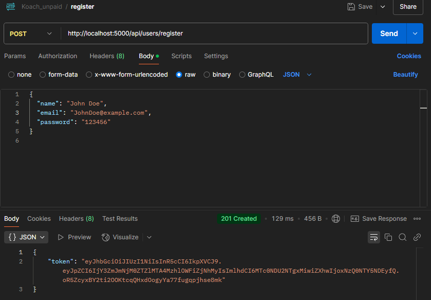
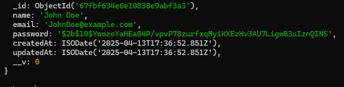
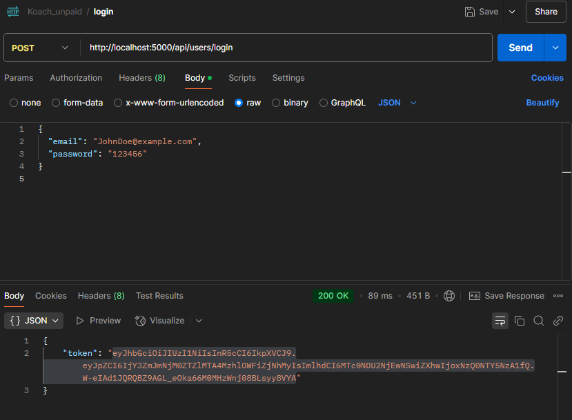
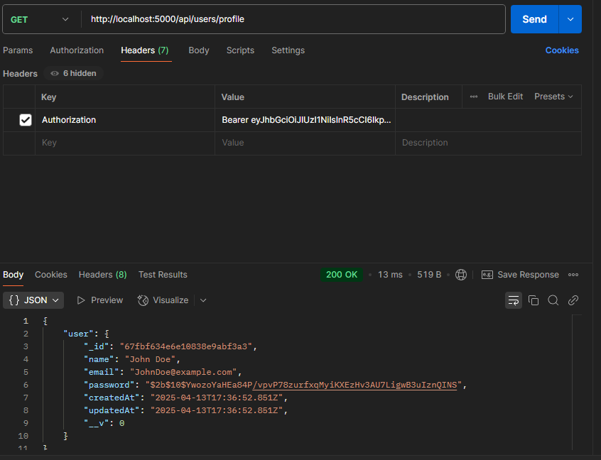
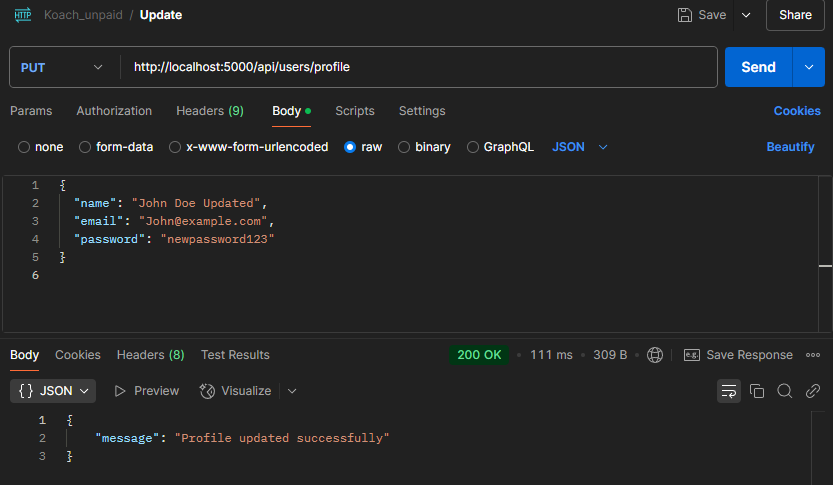
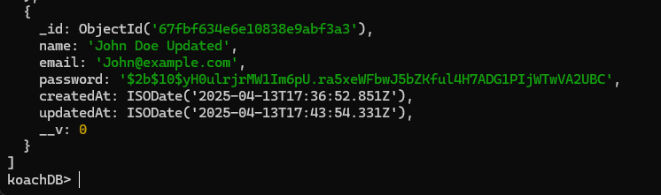
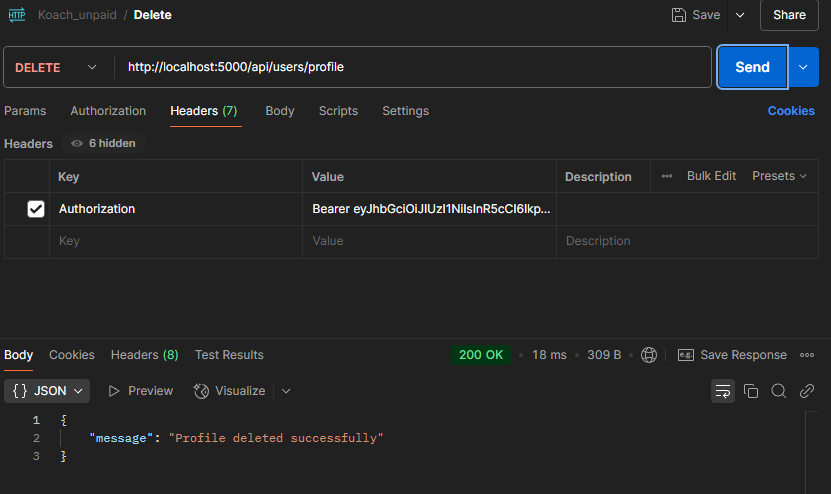
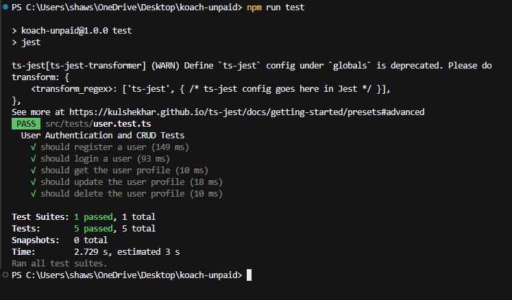
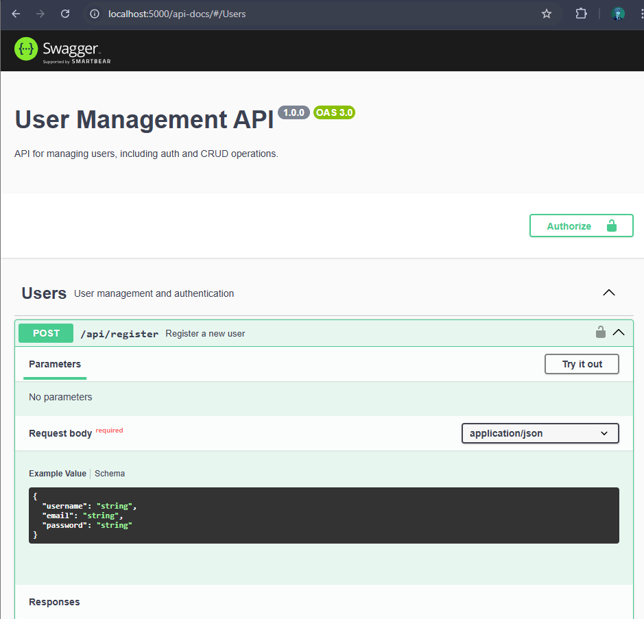

# 👤 User Management System API

A simple and secure user management REST API built with **TypeScript**, **Express.js**, **JWT**, and **MongoDB**. It supports user registration, login, profile retrieval, update, and deletion — all protected with proper authentication and authorization.

---

## 🚀 Features

- 🔐 User Authentication using JWT  
- 📦 CRUD operations on User profile  
- 🧪 Unit Tests with Jest & Supertest  
- 🧾 Swagger API Documentation  
- 🛡️ Route protection for private endpoints  
- 💡 Clean code and modular structure  

---

# 📸 Screenshots

## 📝 Register User



---

## 💾 Stored in MongoDB



---

## 🔐 Login



---

## 👁️ Get User Info



---

## ✏️ Update User



---

## 💽 Updated in MongoDB



---

## ❌ Delete User



---

## 🧹 DB After Deletion


---

## 🧪 `npm run test`



---

## 📘 Swagger API Documentation




## 📁 Tech Stack

- **Backend**: Express.js, TypeScript  
- **Database**: MongoDB (Mongoose)  
- **Authentication**: JWT  
- **Testing**: Jest, Supertest  
- **Docs**: Swagger (OpenAPI)  

---

## 📦 Installation & Setup

```bash
# Clone the repo
git clone https://github.com/your-username/user-management-api.git
cd user-management-api

# Install dependencies
npm install

# Set up environment variables
cp .env.example .env
# Fill in your .env file with appropriate values (MongoDB URI, JWT secret)

# Run the app
npm run dev
```

---

## 🧪 Running Tests

```bash
npm run test
```

---

## 🔐 Authentication

- This API uses **JWT** (Bearer Token) for protecting endpoints.  
- After login/register, include the token in headers:

```http
Authorization: Bearer <your_token_here>
```

---

## 📘 API Documentation

You can explore the full API docs via Swagger:

> 📍 Visit: `http://localhost:5000/api-docs`

---

## 📬 API Endpoints

| Method | Endpoint             | Description                  | Protected |
|--------|----------------------|------------------------------|-----------|
| POST   | `/api/users/register`| Register a new user          | ❌        |
| POST   | `/api/users/login`   | Login user and get token     | ❌        |
| GET    | `/api/users/profile` | Get user profile             | ✅        |
| PUT    | `/api/users/profile` | Update user profile          | ✅        |
| DELETE | `/api/users/profile` | Delete user profile          | ✅        |

---

## 🧑‍💻 Author

**Sumit Shaw**  
[GitHub](https://github.com/sumitkshaw) · [LinkedIn](https://www.linkedin.com/in/sumitshaw27)

---

## 📄 License

This project is licensed under the MIT License.
